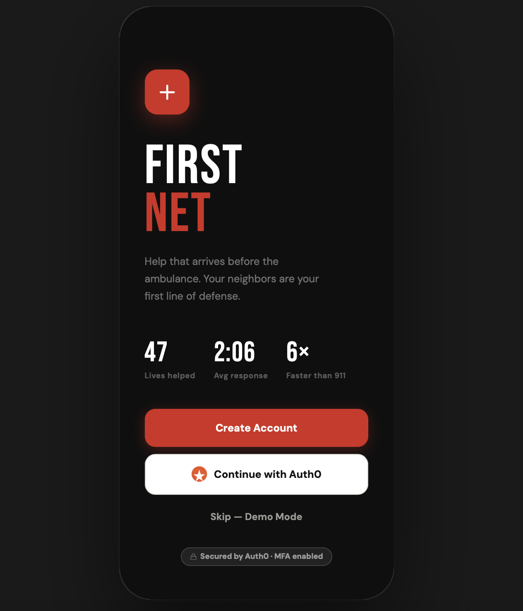
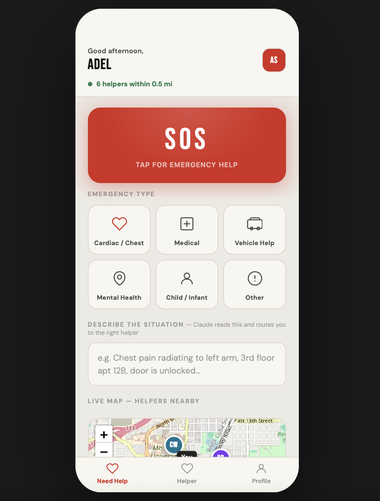
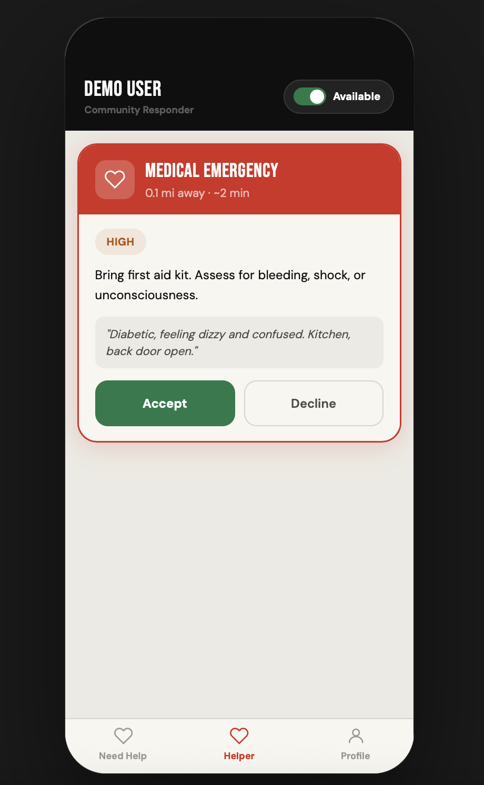
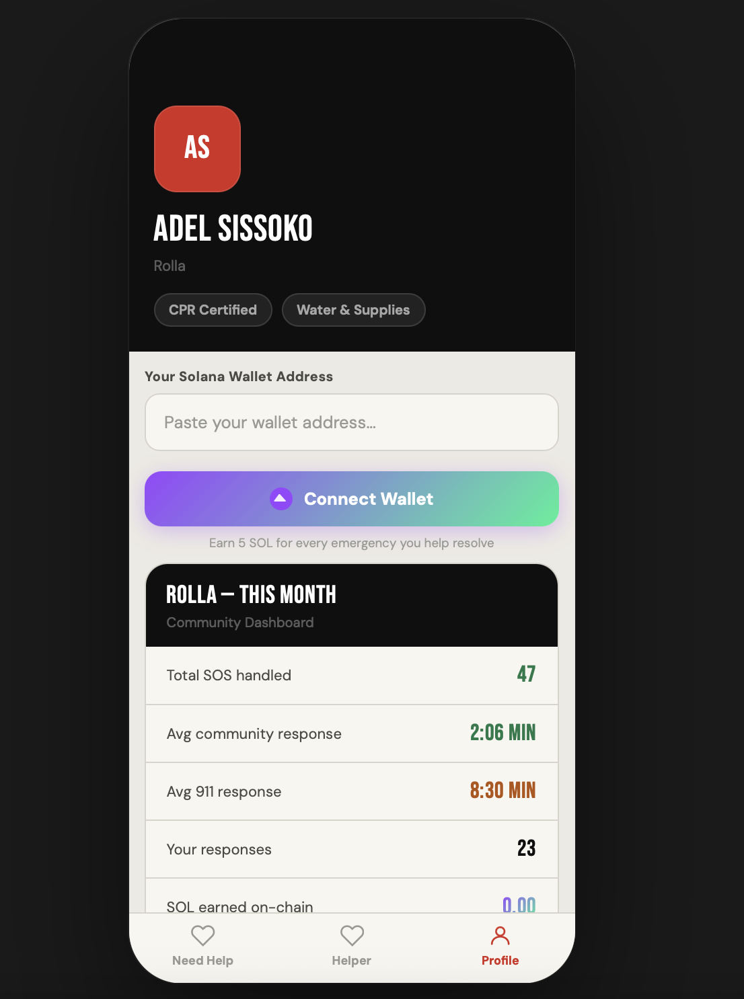
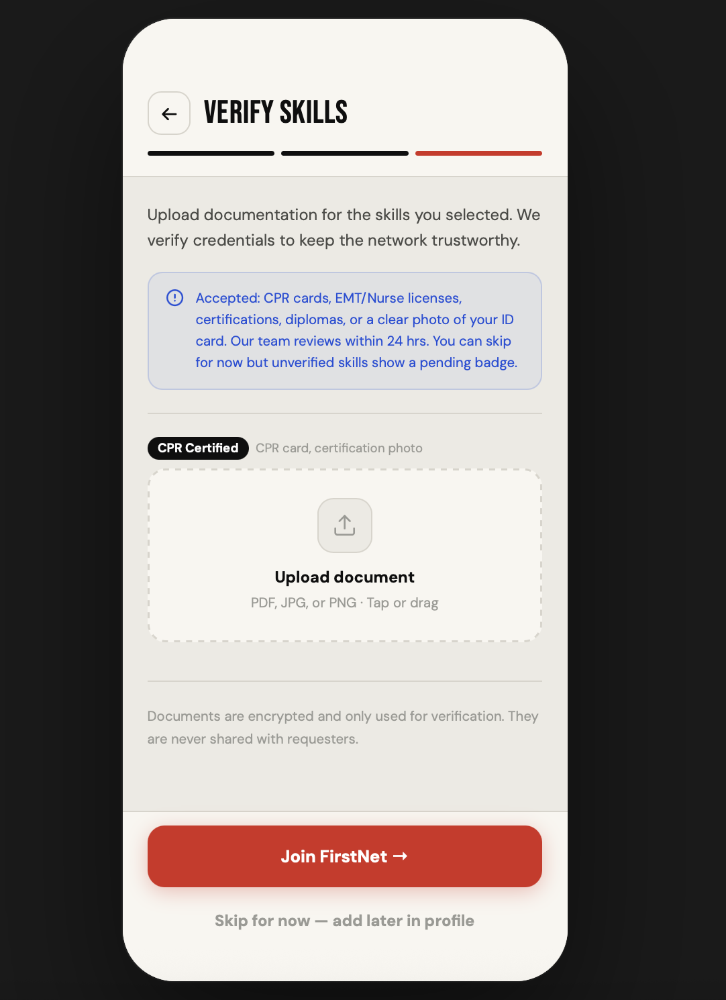
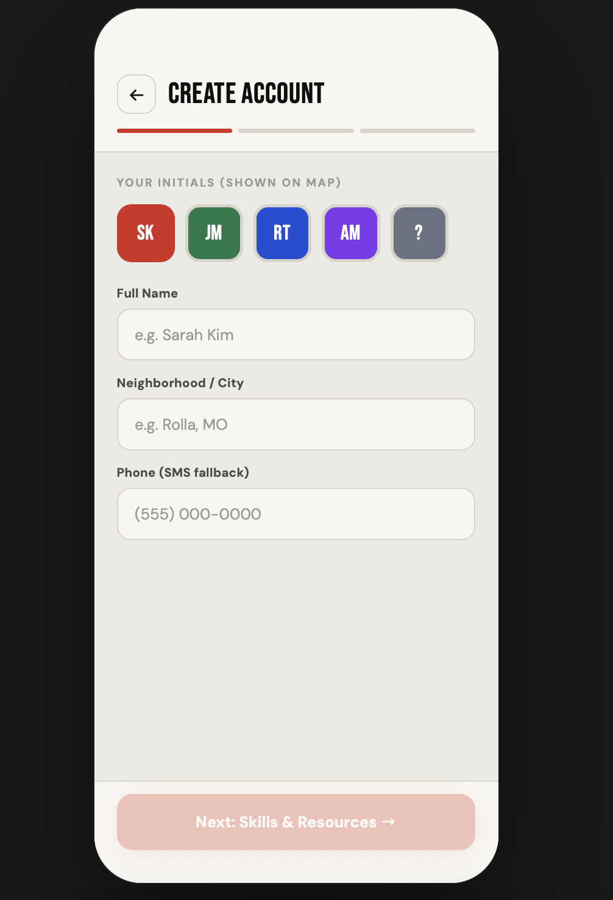
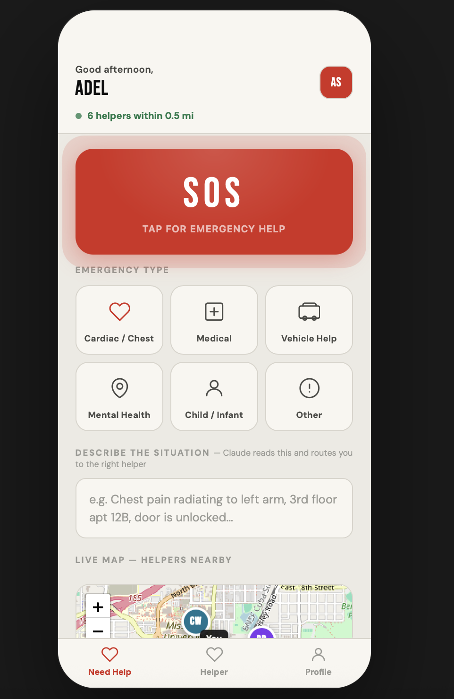

# FirstNet
### Your neighbors are faster than 911.

A community emergency response network that gets a trained neighbor to you before the ambulance arrives. Built solo at **PickHacks 2026 — Missouri S&T**.

---



## The Problem

Cardiac arrest kills in 4 minutes. 911 takes 8–12. That gap is where people die.

$$S(t) = 90\% - 10\% \times t$$

Survival odds drop 10% for every minute without CPR. By the time 911 arrives, it may already be too late. But there's likely someone on your street with CPR training, an AED, or a first aid kit — they just have no way to know you need them.

FirstNet fixes that.

---

## How It Works

<table>
<tr>
<td width="50%">

### 🆘 Need Help
Tap SOS → describe your situation → the **Anthropic Claude API** reads it in real time, triages severity, and routes to the nearest qualified helper.

Not just the closest person — the right person. Someone with CPR *and* an AED if you're having a cardiac event.

</td>
<td width="50%">



</td>
</tr>
<tr>
<td width="50%">



</td>
<td width="50%">

### 🤝 Be a Helper
Get notified for emergencies that match your skills. Accept, get live guidance on what to bring, and chat with the person in need before you arrive.

</td>
</tr>
</table>

---

## Features

- **AI Triage** — Claude API reads free-text descriptions and routes to the right helper based on emergency type, severity, and required skills
- **Live Maps** — real-time helper tracking via Leaflet.js
- **In-app Chat** — two-way chat powered by Claude, both sides talking through one interface
- **Solana Rewards** — helpers earn SOL on-chain every time they resolve an emergency
- **Auth0 Identity** — MFA, social login, verified skill badges so you know who's coming
- **Community Dashboard** — neighborhood response stats vs. 911 average

---

## Solana Integration



When a helper resolves an emergency, the app calls `requestAirdrop` via **Solana Web3.js** on devnet, confirms the transaction on-chain, and links to Solana Explorer. Helpers connect their Phantom wallet in their profile.

Built with a multi-RPC fallback chain across multiple devnet endpoints to handle rate limiting, with a `faucet.solana.com` deeplink as a last resort so rewards never silently fail.

---

## Screens

| Home | Account | Menu |
|------|---------|------|
|  |  |  |

---

## Built With

| Technology | Usage |
|-----------|-------|
| Anthropic Claude API | Real-time AI triage + in-chat guidance |
| Groq API | Low-latency LLM inference for chat layer |
| Solana Web3.js | On-chain SOL rewards on devnet |
| Auth0 | Identity, MFA, verified credentials |
| Leaflet.js | Live maps and helper tracking |
| Vanilla HTML/JS | Everything — single file, no build step |

---

## Run It

No backend. No build step. No dependencies to install.

```bash
# Just open it
open [localhost:3001](http://localhost:3001)
```

Or serve it locally:

```bash
cd Responder
npx serve .
# npm start  → if npx does not pass
# → http://localhost:3001
```

---

## Demo

> *"cardiac arrest kills in 4 minutes. 911 takes 8 to 12. FirstNet fills that gap."*

[](https://your-demo-link-here)

---

## What's Next

- Solana mainnet with a community treasury
- Push notifications for incoming SOS alerts
- Verified responder network — EMTs, nurses, off-duty firefighters
- City partnerships — AED locations, hospital capacity, traffic data

---

*Built solo at PickHacks 2026 — Missouri S&T in 36 hours.*
